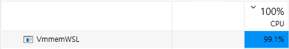

# Handcrafted-CNN

A handcrafted CNN implementation using NumPy for matrix operations instead of loops, very fast, can use 100% usage of CPU for computation.

The model is defined in `model_config.json`, and you can edit it to build various architectures, just like TensorFlow's Sequential. Detailed comments are provided in [nn_layers.py](https://github.com/Avafly/Handcrafted-CNN/blob/main/nn_layers.py), you can clearly understand how each layer propagates, updates, and initializes from the comments.

This repo is inspired by my undergrad project. The training speed was improved by 60x after refactoring the code.

## Available Layers

[Conv](https://github.com/Avafly/Handcrafted-CNN/blob/main/nn_layers.py#L8), [FullyConnected](https://github.com/Avafly/Handcrafted-CNN/blob/main/nn_layers.py#L248), [MaxPool](https://github.com/Avafly/Handcrafted-CNN/blob/main/nn_layers.py#L144), [AvgPool](https://github.com/Avafly/Handcrafted-CNN/blob/main/nn_layers.py#L197), [ReLU](https://github.com/Avafly/Handcrafted-CNN/blob/main/nn_layers.py#L311), [LeakyReLU](https://github.com/Avafly/Handcrafted-CNN/blob/main/nn_layers.py#L344), [BatchNorm2D](https://github.com/Avafly/Handcrafted-CNN/blob/main/nn_layers.py#L377), [BatchNorn1D](https://github.com/Avafly/Handcrafted-CNN/blob/main/nn_layers.py#L456), [Softmax](https://github.com/Avafly/Handcrafted-CNN/blob/main/nn_layers.py#L534), [CrossEntropy](https://github.com/Avafly/Handcrafted-CNN/blob/main/nn_layers.py#L563)

## How to run

1. Create a virtual env and install dependencies:

   ```bash
   pip install tensorflow matplotlib scikit-image
   ```

   - TensorFlow here is only used to download the MNIST dataset.

2. Start training:

   ```bash
   python3 main.py
   ```

## Demo

### Training

<p align="center">
    
</p>

### Evaluation

After training, the model is evaluated using test data.

<p align="center">
    
</p>

If `plot_sample_prediction == True`, a sample prediction plot will be generated after the testing is completed.

<p align="center">
    
</p>

### CPU usage

<p align="center">
    
</p>
