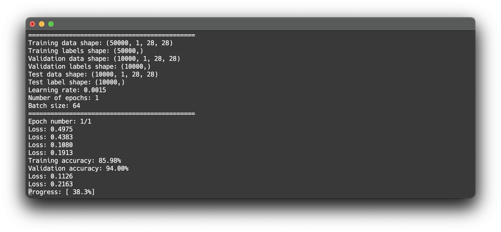
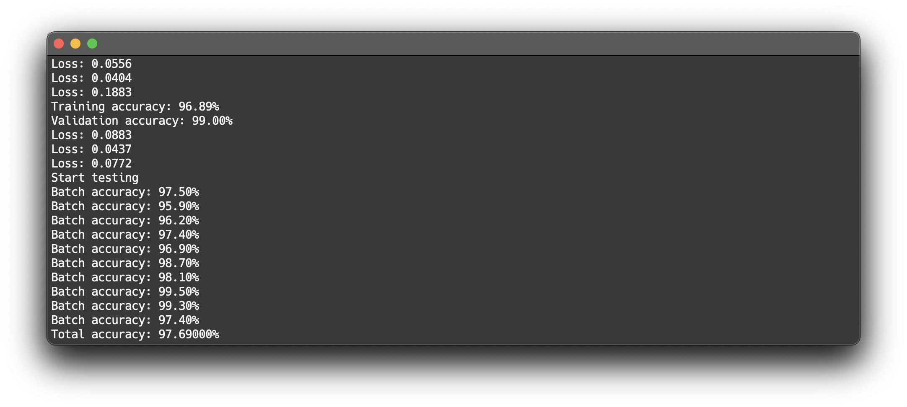
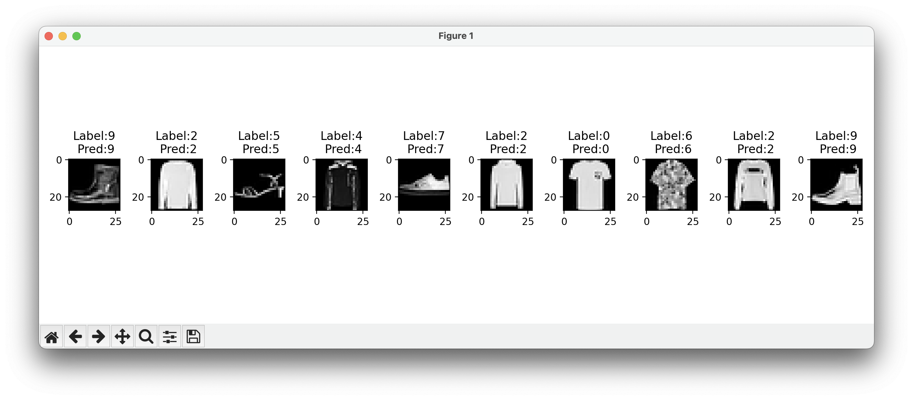
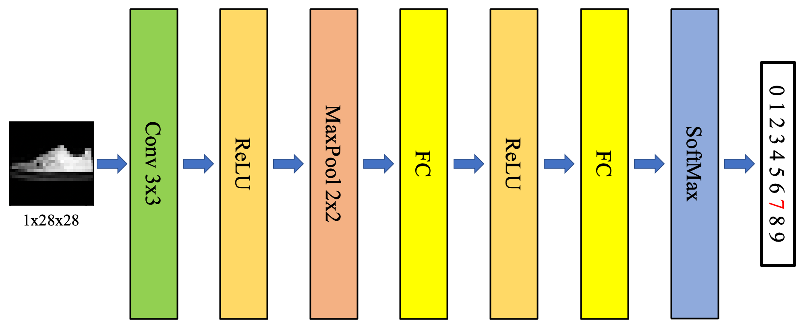
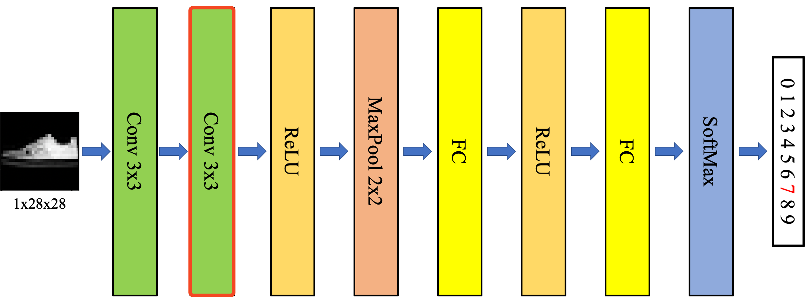

A handcrafted convolutional neural network.

Each layer is designed with flexible, adaptive architecture, accommodating different inputs automatically based on user-defined hyperparameters. Users simply need to define hyperparameters such as the size of the convolutional kernel and the number of channels.

This project was inspired by [assignments](https://github.com/Avafly/Homework-Project/tree/master/DeepLearning/NumPy-CNN) I worked on during my university days, with numerous optimizations made.

## Features

* All computations (e.g., forward and backward propagation, weight updates) are manually implemented using numpy and `view_as_windows`, without reliance on existing libraries, such as TensorFlow and PyTorch.
* Flexible, adaptive layer implementations allow the model to accommodate different inputs based on user-defined hyperparameters.
* Implemented with tensor dot product to perform computations over multiple batches and channel feature maps, instead of the use of iterative loops (e.g., for, while).

## How to run

1. Create a virtual environment and activate it: `python3 -m venv ./hand-dl && source ./hand-dl/bin/activate`
2. Install the required packages: `pip install tensorflow matplotlib scikit-image`
3. Run python file: `python3 main.py`

Since TensorFlow here is only used to download the dataset, either CPU or GPU versions are available.

## Demo

### Training



### Evaluation

After training, the model is evaluated using test data.



If `plot_sample_prediction == True`, a sample prediction plot will be generated after the testing is completed.



## Network architecture




## How to customize

`nn_mnist_classifier` has 4 methods.

* `__init__(self, rmsprop_beta=0.9, lr=1.0e-2)` is responsible for defining the network's layers and modules, initializing the network's parameters, and defining other network-related settings.

* `forward(self, X, y, is_training=True)` is responsible for defining the sequence of operations and the flow of data.

* `backprop(self)` is responsible for defining the sequence of backward propagation.
* `update_weights(self)` is responsible for the weight update.

Here is an example of adding a convolutional layer to the neural network. After adding the convolutional layer, the model's architecture becomes as follows.




First, a new convolutional layer should be created in the `__init__` function.

```python
# convolutional layer 1
self.conv_layer_1 = nnl.nn_convolutional_layer(Wx_size=3, Wy_size=3, in_ch_size=1, out_ch_size=32, pad_size=1)

# convolutional layer 2
self.conv_layer_2 = nnl.nn_convolutional_layer(Wx_size=3, Wy_size=3, in_ch_size=32, out_ch_size=32) # (new layer)
```

Next, the new convolutional layer needs to be added properly in the `forward` function.

```python
cv1_f = self.conv_layer_1.forward(X, is_training)

# the second convolutional layer receives first layer's output as the input
cv2_f = self.conv_layer_2.forward(cv1_f, is_training)   # (new layer)

# and the activation function receives the second layer's output as the input
ac1_f = self.act_1.forward(cv2_f, is_training)
```

Then, define the correct gradient propagation in the `backprop` function.

```python
ac1_b = self.act_1.backprop(mp1_b)

cv2_b, dldw_cv2, dldb_cv2 = self.conv_layer_2.backprop(ac1_b)   # (new layer)
cv1_b, dldw_cv1, dldb_cv1 = self.conv_layer_1.backprop(cv2_b)
```

Finally, add the weight updates of this new layer in the `update_weights` function.

```python
# load dLdW and dLdb for weight update
## ...
dldw_cv2, dldb_cv2 = self.conv_layer_2.get_gradient()   # (new layer)
dldw_cv1, dldb_cv1 = self.conv_layer_1.get_gradient()

# initialize v_w and v_b if it is first time update
if self.is_first_update:
    ## ...

    self.v_w_cv2 = np.zeros_like(dldw_cv2)  # (new layer)
    self.v_b_cv2 = np.zeros_like(dldb_cv2)  # (new layer)

    self.v_w_cv1 = np.zeros_like(dldw_cv1)
    self.v_b_cv1 = np.zeros_like(dldb_cv1)

## ... 
# calculate v for convolutional and FC layer updates
## ...
self.v_w_cv2 = beta*self.v_w_cv2 + (1-beta)*np.square(dldw_cv2) # (new layer)
self.v_b_cv2 = beta*self.v_b_cv2 + (1-beta)*np.square(dldb_cv2) # (new layer)

self.v_w_cv1 = beta*self.v_w_cv1 + (1-beta)*np.square(dldw_cv1)
self.v_b_cv1 = beta*self.v_b_cv1 + (1-beta)*np.square(dldb_cv1)

# using v, perform weight update for each layer
## ...
self.conv_layer_2.update_weights(dLdW=-lr*dldw_cv2/(np.sqrt(self.v_w_cv2)+epsilon),
                                 dLdb=-lr*dldb_cv2/(np.sqrt(self.v_b_cv2)+epsilon)) # (new layer)
self.conv_layer_1.update_weights(dLdW=-lr*dldw_cv1/(np.sqrt(self.v_w_cv1)+epsilon),
                                 dLdb=-lr*dldb_cv1/(np.sqrt(self.v_b_cv1)+epsilon))
```

Now, the new convolutional layer is added. You can use this way to add and connect various network layers to create networks with different architectures.

## TODO

- [ ] Add BatchNormalization layer class
- [ ] Add AveragePooling layer class
- [ ] Add parameters save and load functions

## Remarks

The program does not provide the option to set hyperparameters via command-line arguments, as this is not essential for the purpose of understanding the computations of forward and backward propagation in deep learning networks. The code contains thorough comments, making it straightforward to modify hyperparameters and customize models directly within the code itself.